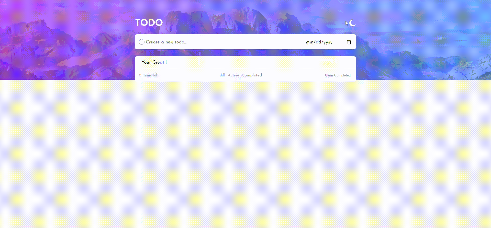

# Todo List
First make sure that you are using the correct Node version as it mention in the `package.json` => `engines`

- You can use `Volta` to switch between multiple node engine [Volta](https://volta.sh/)

## Project setup
```
yarn install
```

## Run server and application
For using `json-server` to simulate the API call, you must run this command first:
```shell
yarn db
```
Then run the application
```shell
yarn serve
```
**Make sure you run both `yarn serve` and `yarn db` in separate terminal, bash or shell**

## Preview

